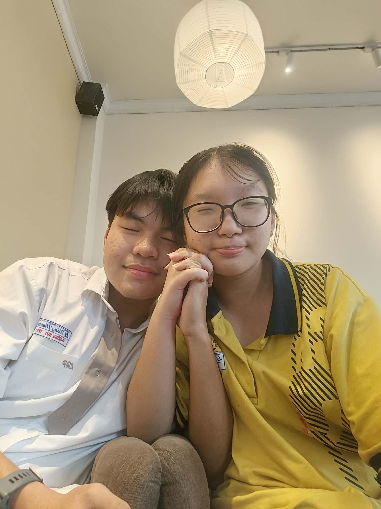
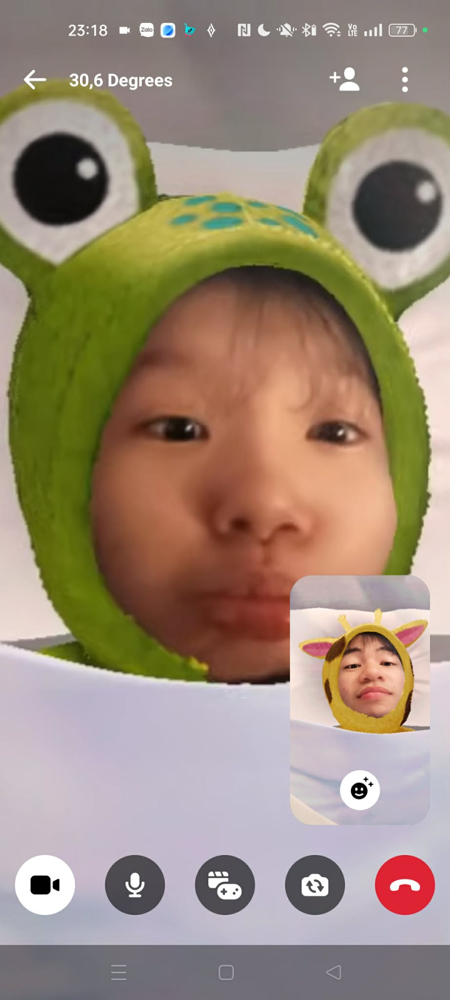
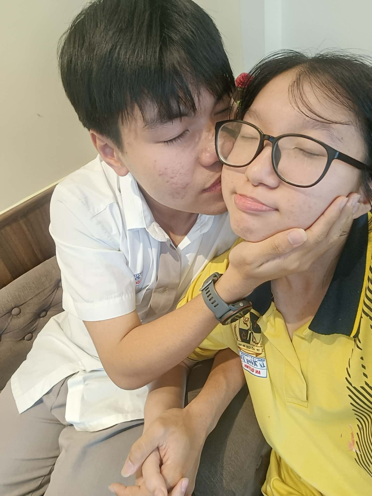
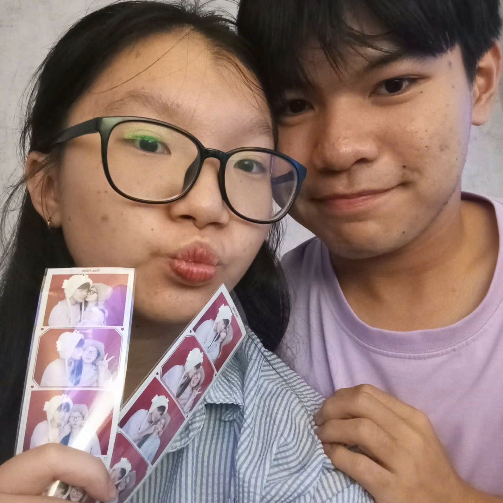

<!DOCTYPE html>
<html lang="vi">
<head>
    <meta charset="UTF-8">
    <meta name="viewport" content="width=device-width, initial-scale=1.0">
    <title>Happy Valentine ❤️ - Huy Yêu Em</title>
    
</head>
<body>
    <canvas id="canvas"></canvas>

    

        

        

        

        

        

    

    

        <!-- Slide 1 -->
        

            
Happy Valentine ❤️

            
Em bé An Quỳnh của tôi ❤️

            
        

        <!-- Slide 2 -->
        

            
Cảm ơn em ✨

            
Vì đã đến bên anh và làm cuộc đời anh trọn vẹn hơn

            
        

        <!-- Slide 3 -->
        

            
Mỗi ngày bên em 💕

            
Là một món quà quý giá mà anh không bao giờ ngừng trân trọng

            
        

        <!-- Slide 4 -->
        

            
Em là tất cả 🌟

            
Anh yêu em không chỉ vì em xinh Mà vì em là ánh sáng trong đời anh

            
        

        <!-- Slide 5 -->
        

            
Mãi mãi yêu em 💖

            
Từ hôm nay đến mãi về sau Anh sẽ luôn ở đây, bên em

            
        

    

    
Kéo chuột để xoay trái tim 💕

    <button class="replay-btn" onclick="replaySequence()">REPLAY</button>

    
</body>
</html>

